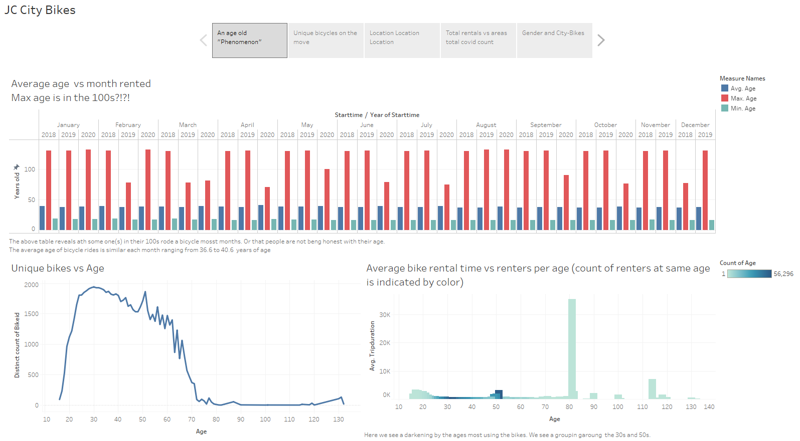
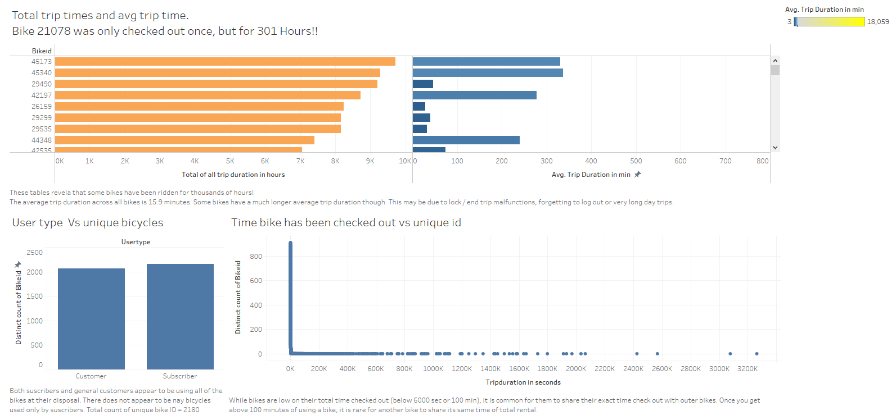
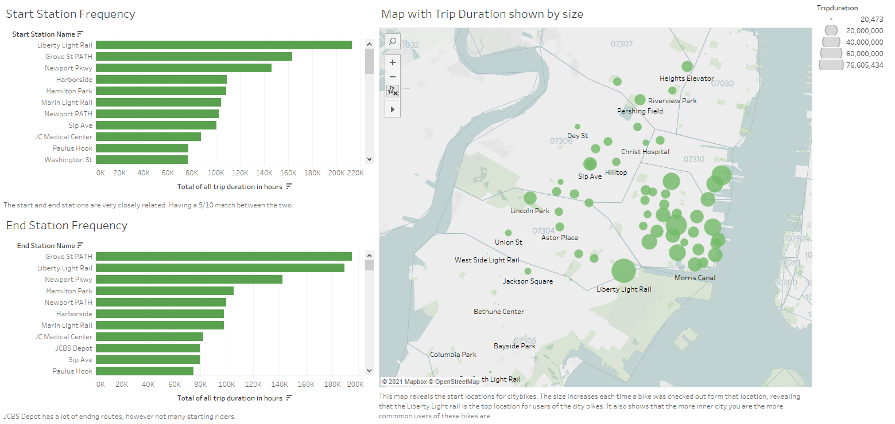
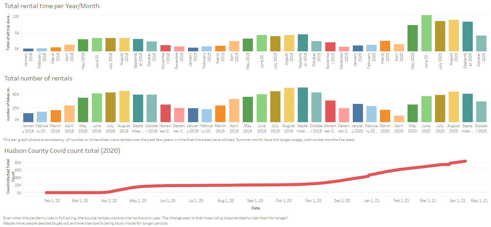
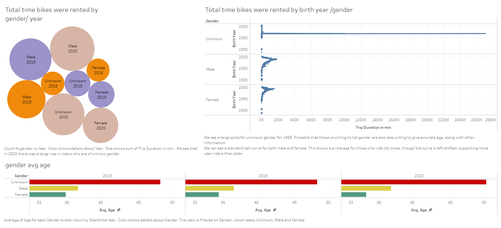

# tableau-LetsRide

Review of 2019-2020 cityBike rentals in Jersey CIty

### An age old "phenomenon" found in data:

This page investigates the age of riders

  * Here we find that the max age for most months is well over 100 years old! 
  * The age range from 20-60 use the most unique bicycles with a peak at 30 years of age.
  * We also see two groups 30 and 50 year old who rent the most bikes. Strangely though we have a spike at 80 for the longest average duration.

### Unique bicycles on the move:

This page investigates unique bicycles.
  * The average trip duration across all bikes is 15.9 minutes however some bikes have been ridden for thousands of hours!
  		One bike in particular was check out for over 300 hours.
  * User type has minimal impact on unique bike usage.
  * If a bike has been check out for less than 100 minutes, it is highly likely to have another bike with the same amount of time used.
      

### Location Location Location: 

This page investigates starting and stopping stations with usage.
  * 9 of the top 10 starting stations are also the top ending stations.
  * The map helps visualize which stations are used most.

### Total rentals vs areas total covid count:

This page investigates monthly rental count and time.
  * Summer months are more active for bike renters both in total ride time and total rentals.
  * During the covid outbreak the total number of rentals decreased slightly while the duration of time rented increased.

### Gender and City-Bikes:

This page investigates gender of city bike users.
  * We see a large rise in unknown gender riders in 2020 (more than female); with male rides out numbering female riders each year.
  * While male and female riders have a normal curve that is reduced as age increases past 30.
	   There is a large spike in unknown gender rider duration born in 1969 
  * Average age of male and female riders stays consistent over the three years observed.
